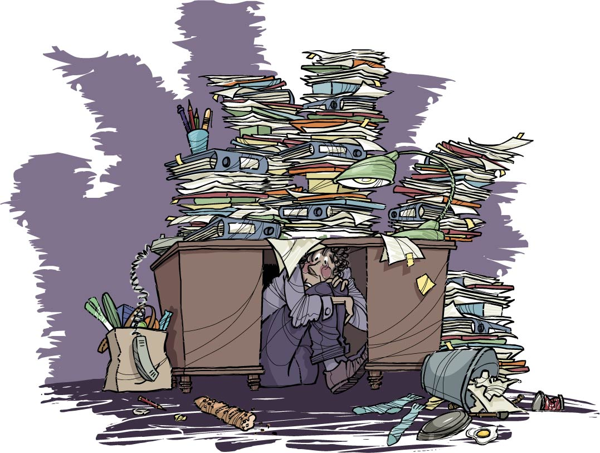
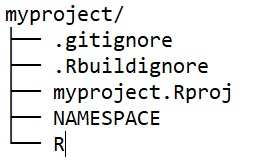
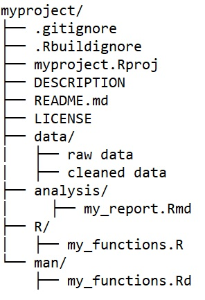

```{r, echo=FALSE}
library(emo)
```


background-image: url("https://media.giphy.com/media/gdUVz1Z6jpMk0/giphy.gif")
background-position: 50% 50%
class: center, inverse

# Happy Groundhog day `r emo::ji("partying_face")`

---

background-image: url("https://media.giphy.com/media/S9crjCfQXC78ST61iv/giphy.gif")
background-position: 50% 50%
class: center

# Reproducibility

---

class: center 

# Where I started...



I try to be a little less disorganized every day...

---

# Main challenges for the user

.pull-left[


The code simply won't run]

.pull-right[


 

The user has no idea where to start]

---

# Making sure your code actually runs

Why might your fully functioning code not run?
- Time! Things change
- Different system setup
  - R packages (and dependencies)
  - R version
  - Operating System
  
How much of this you want to control depends on:
- Your audience
- How users will interface with your code
- The lifetime of your project/code
- Your comfort level 

---

# Different versions of R packages `r emo::ji("expressionless_face")`

## groundhog `r emo::ji("package")`

- Loads a package and its dependencies from CRAN on *any given date*

- Different versions of a package are *automatically* installed *alongside* versions you may already have

- Works within individual scripts (e.g., without .Proj files)

```{r, eval=FALSE}
install.packages("groundhog")

library(groundhog)
groundhog.day="2021-02-02"
pkgs=c('dplyr','nlme','ggplot2')
groundhog.library(pkgs, groundhog.day)
```

---

# Different versions of R packages `r emo::ji("expressionless_face")`

## renv `r emo::ji("package")`

- Records the version of R and R packages being used in a project
- Provides tools for re-installing those versions

```{r, eval=FALSE}
install.packages("renv")

renv::init() # initialize 

# do some coding

renv::snapshot() # save to lockfile
```

```{r, eval=FALSE}
use renv::restore() # restore
```

---

# Different R, RStudio, Operating Systems `r emo::ji("unamused_face")`

<br/>
<br/>

.pull-left[
* **Docker**
  - Captures your virtual environment
  - Computer inside your computer
* **Binder**
  - GitHub repo
  - Launches RStudio server
  - Live and interactive]

.pull-right[]

---

# Hole punch `r emo::ji("package")`

- Reads contents of your R project on GitHub
- Creates a DESCRIPTION file with all dependencies
- Writes a Dockerfile
- Adds a binder badge to your README
- Builds a Docker image

```{r, eval = FALSE}
remotes::install_github("karthik/holepunch")

library(holepunch)

write_compendium_description(
  package = "Compendium name", 
  description = "Compendium description")

write_dockerfile(maintainer = "your_name") 
generate_badge() 
build_binder()
```

[demo](https://github.com/karthik/binder-test)

---

# Understand your audience

And meet them where they are!


* What tools do they use? 
  - R
  - GitHub
  - Docker
* What is their comfort zone, how much are they willing to invest?
* What do you want them to do with your code?
  - Share an end-product, such as a paper + code
  - Re-usable code for consistency across projects 
  - Deep understanding of the code
  - Ability to build on the code
  - Remember what I was doing 6 months ago!!

---

# Documentation

.pull-left[]

.pull-right[Make it easy for the user. 

Lower the barrier.]

<br/>

* Comment your code
* README on GitHub
* Help the user understand where to start
  - GitHub
  - Binder
  - Docker
  - R and RStudio
  - File structure (primary document)
* Document functions and provide examples
* Vignettes
* Website

---

# Staying organized

* Use a familiar / intuitive structure
* Document as you go
* Git commit often
* Don't be too upset by some inevitable chaos in the process

We can learn from the R package structure


---

# Create an R package 

Package up your
* code
* documentation
* data 

It's surprisingly doable!
[Chapter 2](https://r-pkgs.org/whole-game.html) of the R packages book is all you need `r emo::ji("smile")` 

<br/> 



---

# Extend this to a Research Compendium

It's basically an R package with some extra folders



---

# rrtools `r emo::ji("package")`

Hand wavy steps:

```{r, eval=FALSE}
devtools::install_github("benmarwick/rrtools")

create_compendium("~/Documents/MyCompendium")

usethis::use_mit_license(copyright_holder = "My Name")
rrtools::use_readme_rmd()
rrtools::use_analysis()
rrtools::use_dockerfile()
```

---

# workflowr `r emo::ji("package")`

- Provides a project template with organized sub-directories
- Runs each analysis in an isolated R session
- Creates a website to present your research results
- Documents how to host your website for free 
- Require git installed

```{r, eval=FALSE}
install.packages("workflowr")

library("workflowr")

wflow_start("myproject")
wflow_build()

# customize site: write Rmd

wflow_build()
wflow_publish("analysis/*", "Start my new project")
```

---

# Stay focused

When deciding what reproducible steps to take, keep in mind:

* What is your goal?
  - Share a final product
  - Share code within your team
  - Share just a single script
  
* Where is your user? 
  - Be willing to meet them where they are
  - Provide documentation to help get them where they need to be
* Where are you?

  - You don't have to do it all
  - Try to be a little more reproducible with every project

---

# Resources

* [Karthik Ram's 2019 RStudio conference talk](https://rstudio.com/resources/rstudioconf-2019/a-guide-to-modern-reproducible-data-science-with-r-karthik-ram/)
* Marwick, B., Boettiger, C., Mullen, L. (2018). *Packaging Data Analytical Work Reproducibly Using R (and Friends).* Faculty of Science, Medicine and Health - Papers: part A. 5389
* [R Packages book](https://r-pkgs.org/whole-game.html)
* [Anna Krystalli's Research Compendium tutorial](https://annakrystalli.me/rrtools-repro-research/create-compendium.html)
* [Blog post about groundhog package](http:\\datacolada.org/95)
* [Creating vignettes](https://r-pkgs.org/vignettes.html)

### Packages
* [groundhog](www.groundhog.com)
* [renv](https://rstudio.github.io/renv/)
* [hole punch](https://karthik.github.io/holepunch/)
* [rrtools](https://github.com/benmarwick/rrtools) 
* [workflowr](https://jdblischak.github.io/workflowr/)

---

background-image: url("https://media.giphy.com/media/TIhCRE9RVPlS0/giphy.gif")
background-position: 50% 35%
class: center, inverse

# Thanks!
<br/><br/><br/><br/><br/><br/><br/><br/><br/><br/><br/><br/><br/>

<!-- Slides created using [xaringan](https://github.com/yihui/xaringan), following Alison Hill's [tutorial](https://alison.rbind.io/post/2017-12-18-r-ladies-presentation-ninja/) -->

Get a copy of these slides at <br/> [github.com/timschoof/RLadiesTalk](https://github.com/timschoof/RLadiesTalk)